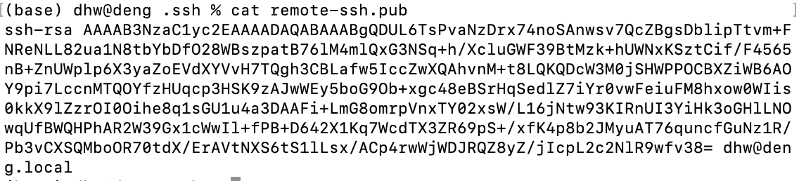

### Git

---

**参考资料：**

* [Pro Git](https://git-scm.com/book/en/v2)
* [MIT missing lecture](https://missing.csail.mit.edu/2020/version-control/)
* [Learing Git Branching](https://learngitbranching.js.org/?locale=en_US)


####  VSC (version control system)

##### Git 的理念

#### Git command

#### 与GitHub交互

- SSH原理

  - SSH key的配置是针对**每台主机**的
  - 当本地主机需要登录远程主机时，本地主机向远程主机发送一个登录请求，远程收到消息后，随机生成一个字符串并用公钥加密，发回给本地。本地拿到该字符串，用存放在本地的私钥进行解密，再次发送到远程，远程比对该解密后的字符串与源字符串是否等同，如果等同则认证成功

- [用SSH连接Github](https://help.github.com/en/github/authenticating-to-github/connecting-to-github-with-ssh)

  1. 生成SSH key ` ssh-keygen -t <type> -f <filename> -c <commment>` 

  2. 获取ssh key 公钥(< filename >.pub)

  3. ` cat < filename >.pub` 显示内容

     

  4. 去Github添加公钥

  5. 验证是否添加成功`ssh -T git@github.com` 

     

- 使用自定义的ssh key名称 (非id_rsa.pub 和id_rsa)

  - 设置**~/.ssh/config**文件

  

#### some bugs

##### 连接相关

- `Failed to connect to github 443` 问题解决方案
  1. `git remote set-url origin git@github.com:huangrt01/XXX.git` , 先把连接方式由https改成ssh
  2. 再在`~/.ssh/config`中把ssh的端口22改成https端口443

```shell
Host github.com
	User xxxxxxx@163.com
	Hostname ssh.github.com
	PreferredAuthentications publickey
	IdentityFile ~/.ssh/id_rsa
	Port 443
```

- git push时提示`Username for 'https://github.com' ` 

  - 建议更改为ssh连接；

  - 使用 `git remote -v` 查看origin使用的是https还是ssh

  - 如果GitHub已经配置了ssh，使用`git remote set-url origin git@github.com:toutouzi/xxx.git` (会修改该项目.git文件下的url)