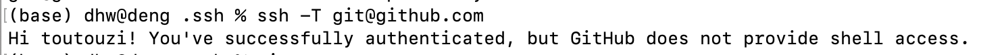

### Git

---

**参考资料：**

* [Pro Git](https://git-scm.com/book/en/v2)
* [MIT missing lecture](https://missing.csail.mit.edu/2020/version-control/)
* [Learing Git Branching](https://learngitbranching.js.org/?locale=en_US)


####  Git data model

---

On disk, all Git stores are objects and references: that’s all there is to Git’s data model. 

##### Snapshots

Git models the history of a collection of files and folders within some top-level directory as a series of snapshots. 

- ==blob== is file (just a bunch of bytes) 
  ==tree== is directory(map name to blob or tree) 


##### Modeling history: relating snapshots

a history is a directed acyclic graph (DAG) of snapshots.(多个父节点)

- ==commit :== is the snapshot

   `o` : individual commit(snapshot)


##### Data model , as pseudocode

```shell
type blob = array<byte>
type tree = map<string, tree | blob>

type commit = struct{
		parants: array<commits>
		author: string
		message: string
		snapshot: tree
}
```

##### Objects and content-addressing

- `type object  = blob | tree | commit` 
- all object 都被映射了地址
- all the snapshots can be identified by their address

```shell
objects = map<string, object>

def store(object):
    id = sha1(object)
    objects[id] = object

def load(id):
    return objects[id]
```

##### References

Git can use human-readable names like “master” to refer to a particular snapshot in the history, instead of a long hexadecimal string.

- 由于地址不好记，将地址map为好记的`references = map<string, string>` 
-  References are pointers to commits. Unlike objects, which are immutable, references are mutable
  -  `master` :表示主分支的最近commit
  - `head`: 当前位置

##### Repositories

just data `objects` and `references` 


#### Staging area

---

Git accommodates such scenarios by allowing you to specify which modifications should be included in the next snapshot through a mechanism called the “staging area”.

- checkout在working directory之间切换；reset从staging area回复到working directory


#### Git command-line interface

---

##### Basic：

- `git help <command>` :   查看某个命令的帮助
- `git init`: 将当前目录初始化为git目录， 数据存储在.git下
- `git status`: tells you what's going on 
- `git add <filename>`:   adds file to staging area
- `git commit`:  create new commit
- `git log`:  show a falttend log history
  - `git log --all --gragh --decorate`:  常用，更方便看
- `git diff <filename>`:  show changes you made relative to the staging area
- `git diff <revision> <filename>`:  shows differences in a file between snapshots
- `git checkout <revision>`: updates HEAD and current branch

##### Branching and merging

- `git branch`: shows branches
- `git branch <name>`: creates a branch
- `git checkout -b <name>`: creates a branch and switches to it
  - same as `git branch <name>; git checkout <name>`
- `git merge <revision>`: merges into current branch
- `git mergetool`: use a fancy tool to help resolve merge conflicts
- `git rebase`: rebase set of patches onto a new base

##### Remotes

- `git remote`:  list remotes
- `git remote add <name> <url>`: add a remote
- `git push <remote> <local branch>:<remote branch>`
- `git branch --set-upstream-to=<remote>/<remote branch> `:set up correspondence between local and remote branch   
- `git fetch`: retrieve objects/references from a remote
- `git pull`:  same as `git fetch; git merge`
- `git clone`

##### Undo 

- `git commit --amend`: edit a commit’s contents/message
- `git reset HEAD <file>`: unstage a file
- `git checkout -- <file>`: discard changes

##### Advanced Git

- `.gitignore`: [specify](https://git-scm.com/docs/gitignore) intentionally untracked files to ignore
  - `.gitignore_global`，[参考设定](https://github.com/huangrt01/dotfiles/blob/master/gitignore_global)
- `git bisect`: binary search history (e.g. for regressions)
- `git clone --depth=1`: shallow clone, without entire version history
- `git add -p`: interactive staging
- `git rebase -i`: interactive rebasing
- `git blame`: show who last edited which line

- `git cat-file -p`: 显示对象信息
  * 40位Hash值，前2位是文件夹，后38位是文件名
  * 存在`.git/objects/`中 
  * [理解git常用命令原理](http://www.cppblog.com/kevinlynx/archive/2014/09/09/208257.html)
- `git config`: Git is [highly customizable](https://git-scm.com/docs/git-config)
  - `/etc/gitconfig`对应`--system` 
  - `~/.gitconfig`或`~/.config/git/config`对应 `--global`
  - `path/.git/config`对应`--local`
  - `git config --list (--show-origin)`显示所有config
  - 设置Identity，见下面Github部分
- `git stash`: temporarily remove modifications to working directory
  - `git stash pop [--index][stash@{id}]`
    - `git stash pop` 恢复最新的进度到工作区
    - `git stash pop --index` 恢复最新的进度到工作区和暂存区
    - `git stash pop stash@{1}` 恢复指定的进度到工作区。stash_id是通过git stash list命令得到的。通过git stash pop命令恢复进度后，会删除当前进度

  - `git stash show -p | git apply -R`
- `git cherry-pick`
  - [利用它只pull request一个特定的commit](https://www.iteye.com/blog/bucketli-2442195)
  - `git cherry-pick commit1..commit2`
- `git submodule add <url> /path`
  * clone之后初始化：`git submodule update --init --recursive`
    * 仅初始化一个特定的submodule：`git submodule update <specific path to submodule>`
  * 更新：`git submodule update --remote & ga . & gc -m "commit message"  `
  * 移除submodule：https://stackoverflow.com/questions/1260748/how-do-i-remove-a-submodule/36593218#36593218
  * 如果报错already exists in the index ，用`git rm -r --cached /path`解决此问题 
  * 这个特性很适合和[dotfiles](https://github.com/huangrt01/dotfiles)搭配，但如果用在项目里可能[出现问题](https://codingkilledthecat.wordpress.com/2012/04/28/why-your-company-shouldnt-use-git-submodules/)，尤其是需要commit模块代码的时候
  * [使用时可能遇到的坑的集合](https://blog.csdn.net/a13271785989/article/details/42777793)
  * commit的时候有坑，需要先commit子模块，再commit主体，参考：https://stackoverflow.com/questions/8488887/git-error-changes-not-staged-for-commit


#### 与GitHub交互

---

- SSH原理

  - SSH key的配置是针对**每台主机**的
  - 当本地主机需要登录远程主机时，本地主机向远程主机发送一个登录请求，远程收到消息后，随机生成一个字符串并用公钥加密，发回给本地。本地拿到该字符串，用存放在本地的私钥进行解密，再次发送到远程，远程比对该解密后的字符串与源字符串是否等同，如果等同则认证成功

- [用SSH连接Github](https://help.github.com/en/github/authenticating-to-github/connecting-to-github-with-ssh)

  1. 生成SSH key ` ssh-keygen -t <type> -f <filename> -c <commment>` 

  2. 获取ssh key 公钥(< filename >.pub)

  3. ` cat < filename >.pub` 显示内容

     

  4. 去Github添加公钥

  5. 验证是否添加成功`ssh -T git@github.com` 

     

- 使用自定义的ssh key名称 (非id_rsa.pub 和id_rsa)

  - 设置**~/.ssh/config**文件

  
  
- 建立仓库

  ``` 
  git init
  git remote add origin git@github.com:huangrt01/dotfiles.git
  git pull --rebase origin master
  git push --set-upstream origin master
  ```

  

#### Some Bugs

---

##### 连接相关

- `Failed to connect to github 443` 问题解决方案
  1. `git remote set-url origin git@github.com:huangrt01/XXX.git` , 先把连接方式由https改成ssh
  2. 再在`~/.ssh/config`中把ssh的端口22改成https端口443

```shell
Host github.com
	User xxxxxxx@163.com
	Hostname ssh.github.com
	PreferredAuthentications publickey
	IdentityFile ~/.ssh/id_rsa
	Port 443
```

- git push时提示`Username for 'https://github.com' ` 

  - 建议更改为ssh连接；
  - 使用 `git remote -v` 查看origin使用的是https还是ssh
  - 如果GitHub已经配置了ssh，使用`git remote set-url origin git@github.com:toutouzi/xxx.git` (会修改该项目.git文件下的url)


#### Other Resources

---

##### Miscellaneous

- **GUIs**: there are many [GUI clients](https://git-scm.com/downloads/guis) out there for Git. We personally don’t use them and use the command-line interface instead.
- **Shell integration**: it’s super handy to have a Git status as part of your shell prompt ([zsh](https://github.com/olivierverdier/zsh-git-prompt), [bash](https://github.com/magicmonty/bash-git-prompt)). Often included in frameworks like [Oh My Zsh](https://github.com/ohmyzsh/ohmyzsh).
- **Editor integration**: similarly to the above, handy integrations with many features. [fugitive.vim](https://github.com/tpope/vim-fugitive) is the standard one for Vim.
- **Workflows**: we taught you the data model, plus some basic commands; we didn’t tell you what practices to follow when working on big projects (and there are [many](https://nvie.com/posts/a-successful-git-branching-model/) [different](https://www.endoflineblog.com/gitflow-considered-harmful) [approaches](https://www.atlassian.com/git/tutorials/comparing-workflows/gitflow-workflow)).

##### 教程

- [Pro Git](https://git-scm.com/book/en/v2) is **highly recommended reading**. Going through Chapters 1–5 should teach you most of what you need to use Git proficiently, now that you understand the data model. The later chapters have some interesting, advanced material.
- [Oh Shit, Git!?!](https://ohshitgit.com/) is a short guide on how to recover from some common Git mistakes.
- [Git for Computer Scientists](https://eagain.net/articles/git-for-computer-scientists/) is a short explanation of Git’s data model, with less pseudocode and more fancy diagrams than these lecture notes.
- [Git from the Bottom Up](https://jwiegley.github.io/git-from-the-bottom-up/) is a detailed explanation of Git’s implementation details beyond just the data model, for the curious.
- [How to explain git in simple words](https://smusamashah.github.io/blog/2017/10/14/explain-git-in-simple-words)
- [Learn Git Branching](https://learngitbranching.js.org/) is a browser-based game that teaches you Git.